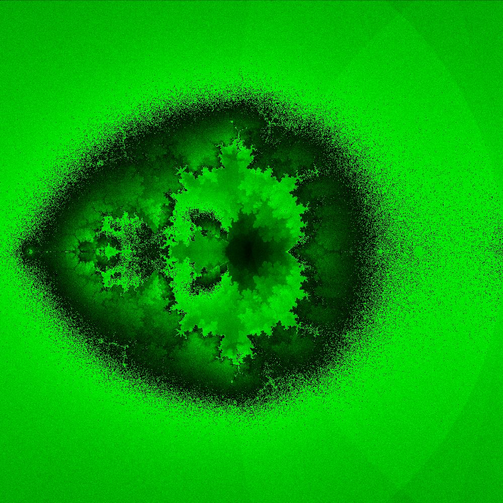
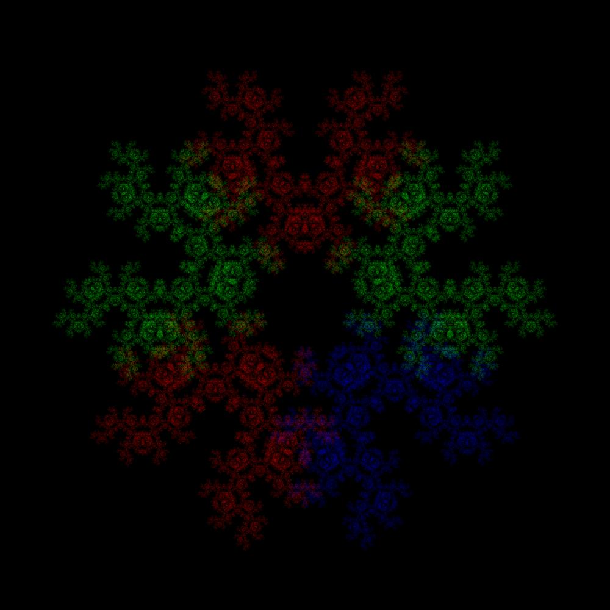
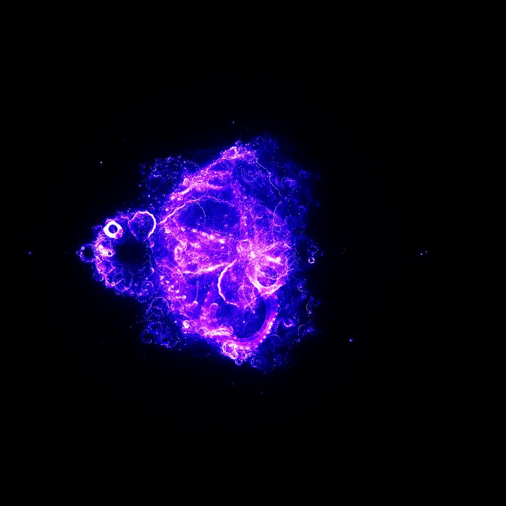
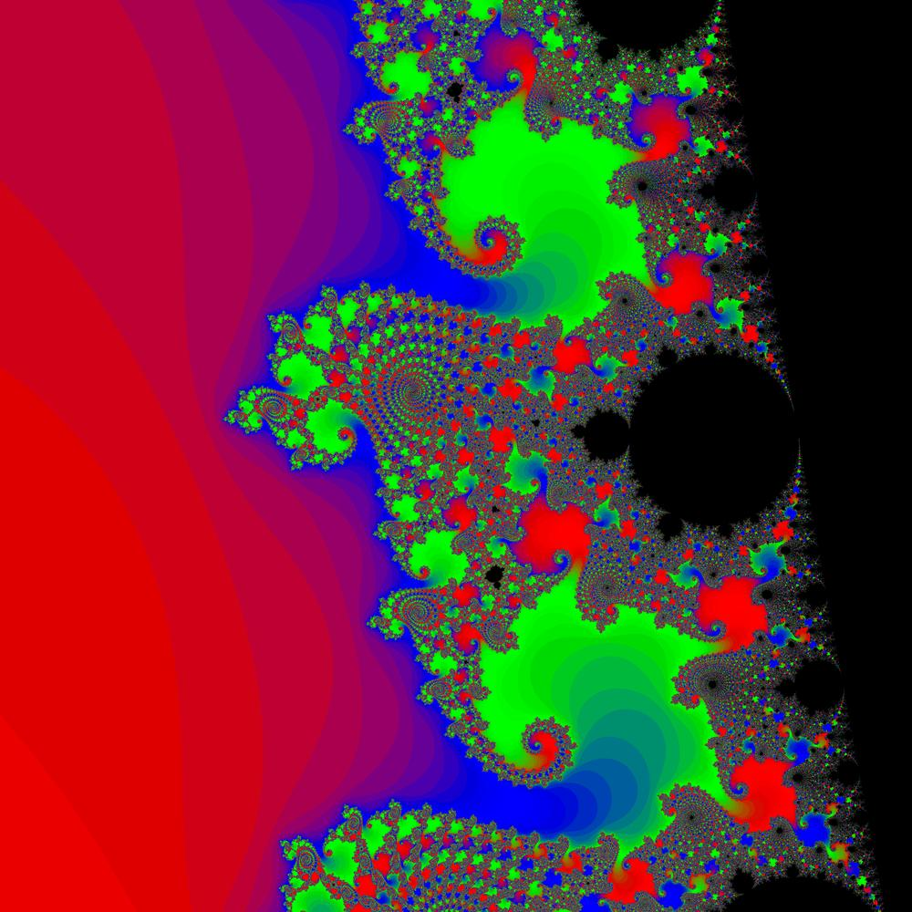
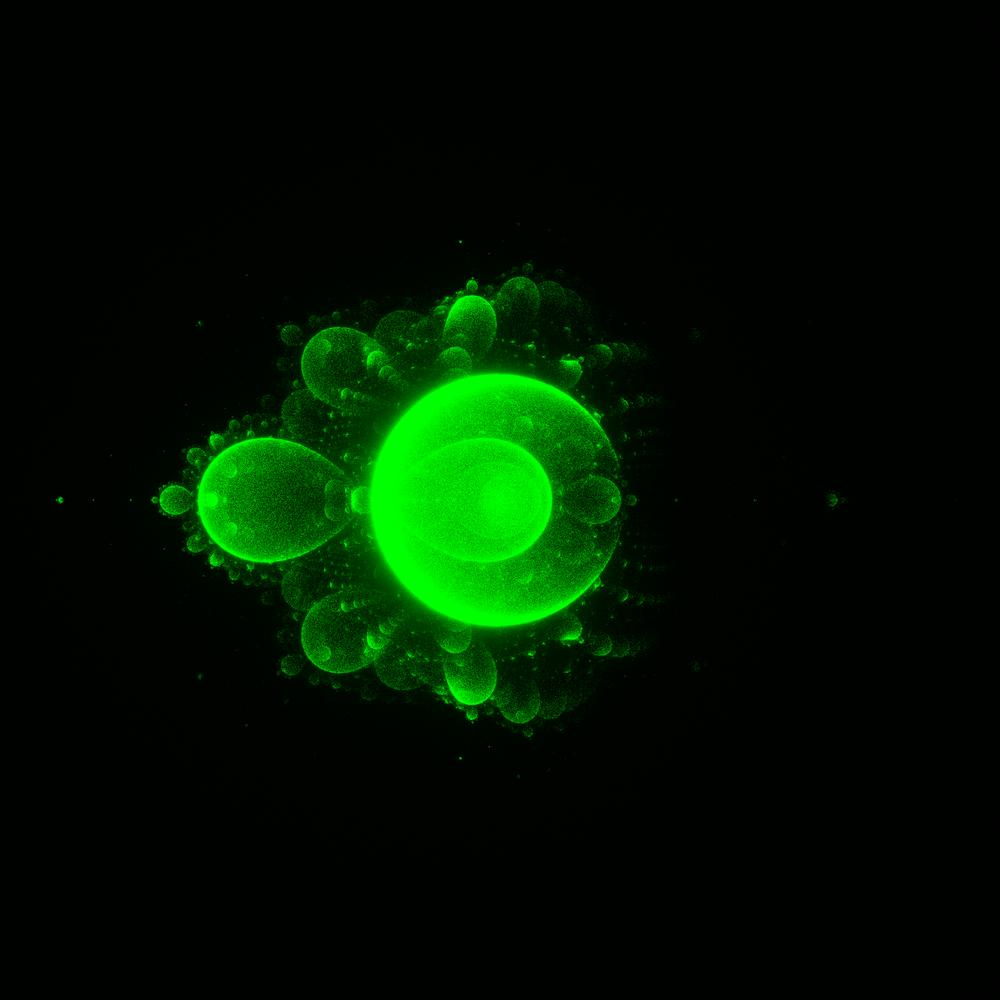
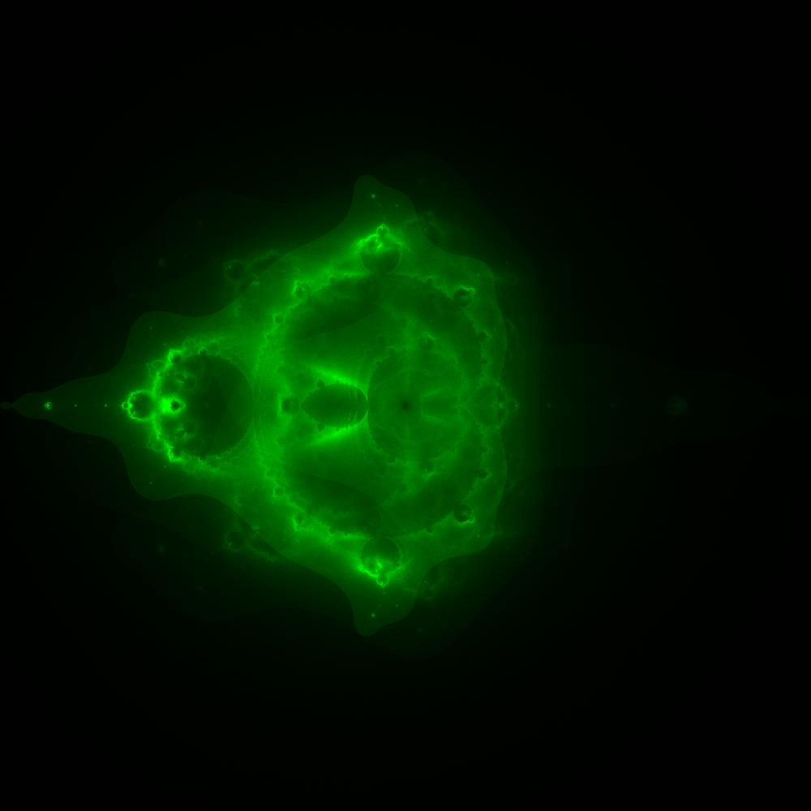
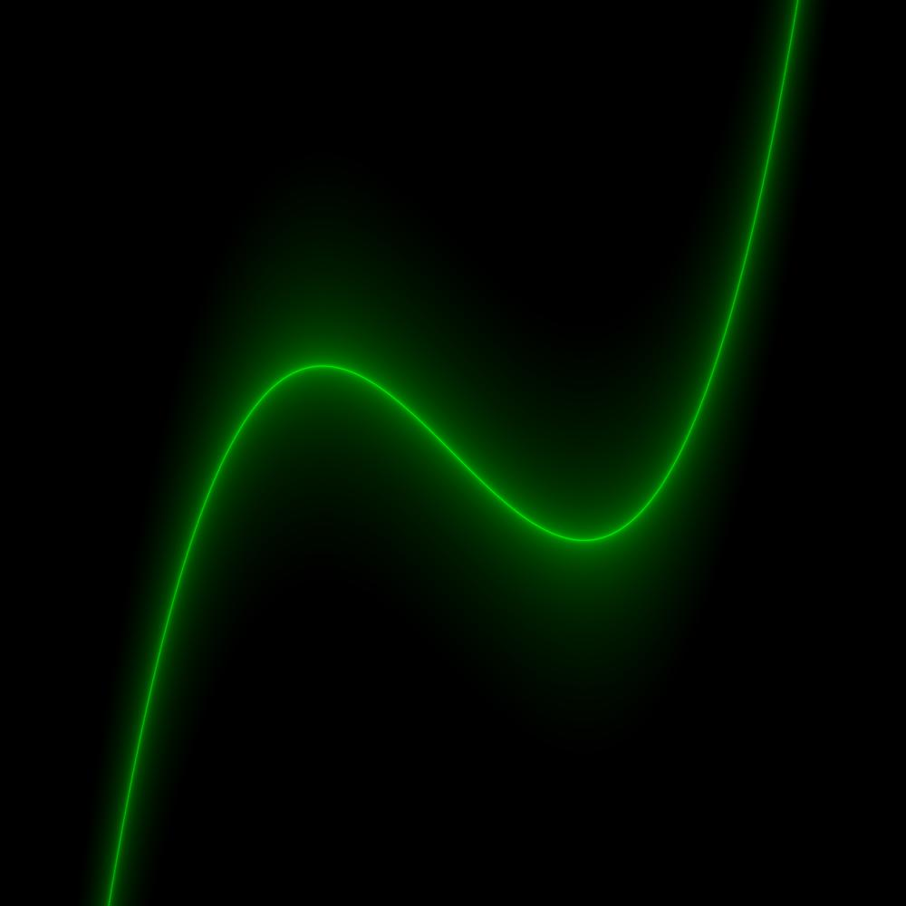

# about
i love fractals, so i made this to generate fractals (mainly buddhabrot) and look at them for hours. can also plot~~ 2d equations

# features
- create fractal images of
  - mandlebrot
  - buddhabrot
  - chaos game
- plot graphs of functions

# some images/fractals generated by the program
(i had to scale down the images)








# how to run
- clone repo
- cd to rust dir
- ```cargo run --release```
- you can change the configuration in respective files
- comment/uncomment lines in src/main.rs